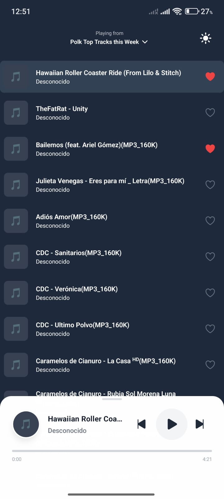
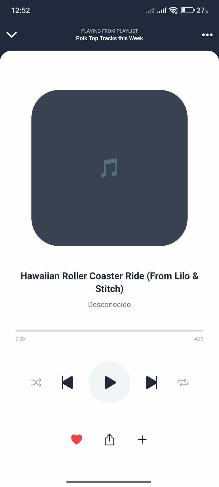

# Mobile Music Player

Una aplicación móvil de reproductor de música construida con React Native, Expo y TypeScript. Permite reproducir canciones locales del dispositivo, gestionar favoritos, cambiar entre modo claro/oscuro y disfrutar de una interfaz animada y moderna.

## Captura de pantalla






## Características

- 🎵 Reproduce archivos de audio locales del dispositivo.
- 💾 Solicita permisos de acceso a la biblioteca de medios.
- 🖤 Marca canciones como favoritas.
- 🌙 Cambia entre modo claro y oscuro.
- 🎚️ Mini reproductor y reproductor expandido con animaciones fluidas.
- 📱 Interfaz responsiva y moderna usando Tailwind CSS (NativeWind).
- ⚡ Control de reproducción: play, pause, siguiente, anterior.
- 🎛️ Barra de progreso animada y ecualizador visual.

## Estructura del Proyecto

- `/app`: Entrypoint y layout principal.
- `/src/components`: Componentes UI y de reproductor.
- `/src/context`: Contexto global para la playlist.
- `/src/hooks`: Hooks personalizados para lógica de reproducción, animaciones y permisos.
- `/src/utils`: Utilidades y constantes.
- `/assets`: Iconos e imágenes.

## Instalación

1. Clona el repositorio:
   ```sh
   git clone https://github.com/tu-usuario/mobile-music-player.git
   cd mobile-music-player
   ```

2. Instala las dependencias:
   ```sh
   npm install
   ```

3. Ejecuta la app en modo desarrollo:
   ```sh
   npm run start
   ```
   O para Android/iOS:
   ```sh
   npm run android
   npm run ios
   ```

## Requisitos

- Node.js >= 18
- Expo CLI (`npm install -g expo-cli`)
- Un emulador Android/iOS o dispositivo físico

## Scripts útiles

- `npm run start` — Inicia el servidor de desarrollo de Expo.
- `npm run android` — Ejecuta la app en un emulador/dispositivo Android.
- `npm run ios` — Ejecuta la app en un emulador/dispositivo iOS.
- `npm run lint` — Linting y formateo del código.
- `npm run format` — Formatea el código automáticamente.

## Personalización

- Los estilos se gestionan con [Tailwind CSS](https://tailwindcss.com/) vía [NativeWind](https://www.nativewind.dev/).
- Los archivos de audio se cargan automáticamente desde la biblioteca del dispositivo (requiere permisos).
- Puedes modificar los componentes en [`src/components`](src/components) y la lógica en [`src/hooks`](src/hooks).

## Licencia

MIT

---

Desarrollado con ❤️ usando Expo y